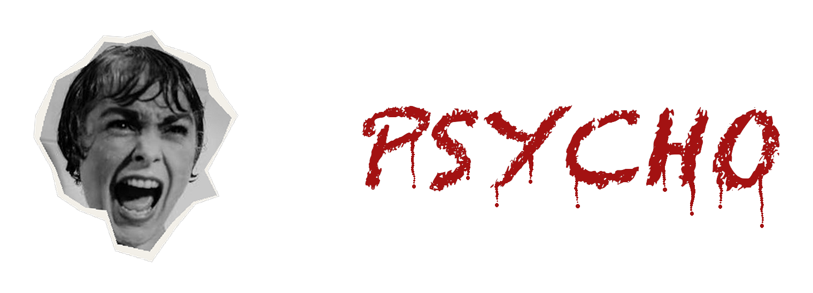
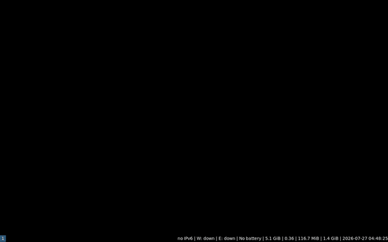
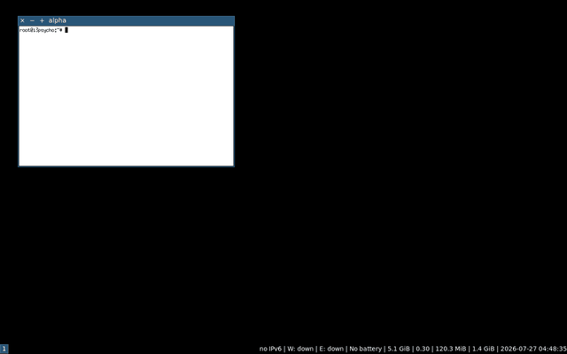
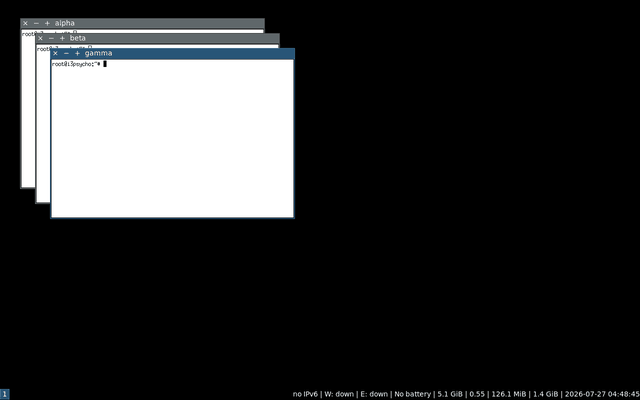
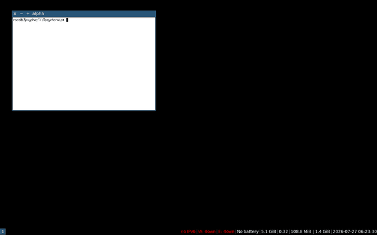

 
 

i3psycho is i3 after it went a little mad sometimes: every window floats.
Cascade placement, titlebar buttons, drag-to-edge snapping with a live
preview, minimize that checks out and comes back, an overview, hot corners.
Seven patches on upstream i3 and one small daemon. Your config runs
unmodified, upstream's entire test suite still passes, and the blue
titlebar survives the shower scene. Tiling still exists, you monster.

 - Documentation: [userguide.txt](userguide.txt)
 - Install: Arch users see packaging/; everyone else, packaging/build-i3psycho.sh
 - License: BSD, same as i3

We would never harm a workflow. It was already broken when we got here.
